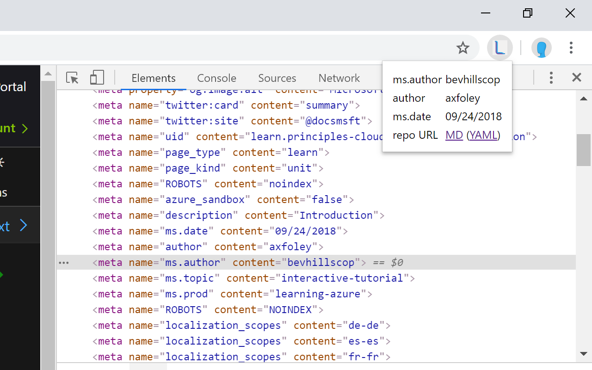
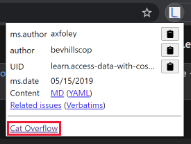
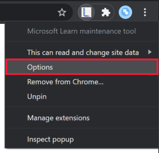
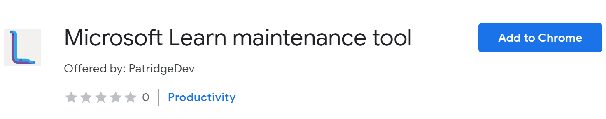
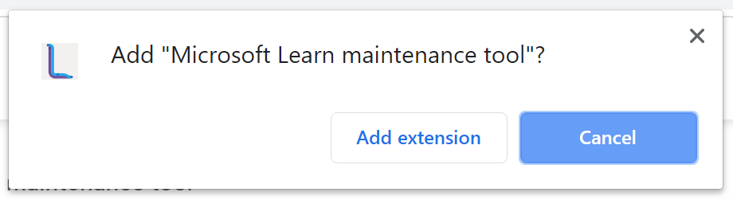
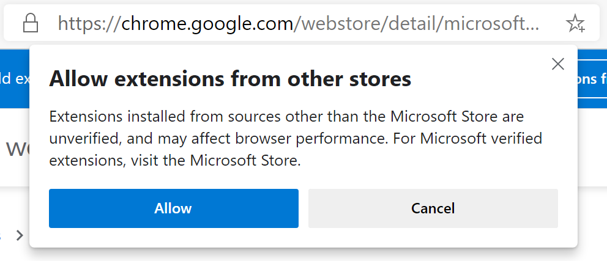
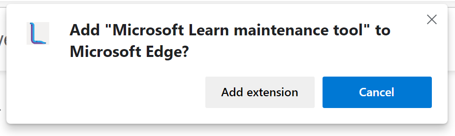

# Learn Maintenance Tool

Determine the author of a given Microsoft Learn or Microsoft Docs page. And quickly navigate to the content in GitHub to propose edits. This tool was created for the Microsoft Learn content team to help triage user-reported feedback to the right maintainer, but anyone is welcome to use it if it helps them.

## Features

### View Microsoft Learn and Microsoft Docs page metadata

When you are viewing a Microsoft Learn or Microsoft Docs content page, clicking the Learn Maintenance Tool extension will show a pop-up with useful page metadata fields, each with a copy button to allow for easy pasting where you need it. The pop-up also includes clickable links to open the YAML and Markdown pages for editing directly in GitHub.

This is the information currently being extracted:

* `ms.author`
* `author`
* `ms.date`
* `uid`
* Edit URL(s), either `original_content_git_url` or a modified version of `original_ref_skeleton_git_url` for YAML and/or Markdown pages

### View Microsoft Learn content page from Azure DevOps customer feedback work items

When you are viewing a customer feedback work item for a Microsoft Learn page the Learn Maintenance Tool extension will show a pop-up with some useful metadata fields and a link to view other open feedback for this unit and parent module as well as any customer feedback rating verbatims. This way, you can tackle several work items in a single maintenance session.

### Optional pop-up link

If you regularly need to go to a page as part of your maintenance efforts, you can have the Learn Maintenance Tool pop-up offer a link to that page to have it handy at all times.

This link is hidden by default, but can be enabled and configured in the extension options page.

1. Right-click the extension button in your browser and select **Options**. You can also find an **Extension options** link to select from the extension details.

    

1. Within the options, first enable the link by selecting the **Show link** button and confirming you want to enable it. (To disable it when it is shown, select the **Hide link** button and confirm.)
1. To customize the link name or URL the link navigates to, edit the **Set link label** and **Set link URL** fields and select the **Set custom link** button.

The next time you open the extension pop-up your link should be shown and will open in a new tab.

## Installation

If you are using Google Chrome or the Chromium-based Microsoft Edge, you can install the [Microsoft Learn maintenance tool extension](https://chrome.google.com/webstore/detail/microsoft-learn-maintenan/kagphmnlicelfcbbhhmgjcpgnbponlda) to allow retrieving Learn page metadata from the browser toolbar.

### Google Chrome

Installation on Google Chrome works as you would install any other Chrome extension found on the Chrome Web Store.

1. Visit the [Microsoft Learn maintenance tool extension page on the Chrome Web Store](https://chrome.google.com/webstore/detail/microsoft-learn-maintenan/kagphmnlicelfcbbhhmgjcpgnbponlda).
1. Click the **Add to Chrome** button on the extension page.
    
1. Confirm the extension install by clicking the **Add extension** button from the resulting pop-up.
    

### Microsoft Edge

For Microsoft Edge, you'll first need to allow installing extensions from other stores. You can do this from the extension page on the Chrome Web Store above. Edge will put a header in place to guide you to allow Chrome Web Store extensions.

1. Click the **Allow extensions from other stores** button from the header in Edge.
    
1. Confirm enabling other stores by clicking the **Allow** button from the resulting pop-up.
    

> [!NOTE]
> You can also toggle this setting from the **Extensions** page. Expand the left-hand menu, if needed, and toggle the **Allow extensions from other stores** option.

1. Visit the [Microsoft Learn maintenance tool extension page on the Chrome Web Store](https://chrome.google.com/webstore/detail/microsoft-learn-maintenan/kagphmnlicelfcbbhhmgjcpgnbponlda).
1. Click the **Add to Chrome** button on the extension page.
1. Confirm the extension install by clicking the **Add extension** button from the resulting pop-up.
    

## Release notes

### v0.7

* [v0.7.5] Add support for notebook embedded content on Learn
* [v0.7.5] Fix issues when navigating to source links from outside en-us locale
* [v0.7.4] Add optional custom link to pop-up window for common maintenance page (defaults to Learn Azure team's triage query on Azure DevOps)
* [v0.7.3] Also offer related issues/verbatims from Learn pages (no longer just on Azure DevOps work items)
* [v0.7.3] Get content URL properly from Technical Review work items in Azure DevOps
* [v0.7.2] Fix for missing Markdown edit link after Learn switched metadata fields (#45)
* [v0.7.1] Related work item query now only excludes star rating verbatims (#42)
* [v0.7.1] Azure DevOps: Handle when multiple work item structures exist in page HTML (#40)
* [v0.7.0] Extract UID from module work items
* [v0.7.0] While on an Azure DevOps customer feedback work item, extract metadata from the target content page when the extension is activated

### v0.6

* Allow use on Azure DevOps from alternate domain: dev.azure.com/{team}/{project}
* Offer UID when gathering metadata for Learn content pages
* Fix issues with correct pop-up not loading in some situations
* Truncate long metadata values while offering full text in a hover value
* Fix GitHub URL for Docs pages with the correct branch

## Roadmap

Here are the current plans for upcoming releases. These are definitely subject to change as this project develops or evolves.

### v0.8+: Customization

* Allow customizing which metadata fields are important to you

### Future plans and suggestions

You can follow along with planned development efforts by [looking at the open GitHub issues with the **enhancement** tag](https://github.com/patridge/learn-metadata-tool/issues?q=is%3Aissue+is%3Aopen+label%3Aenhancement). If you have a feature or suggestion you want to propose, [submit your own enhancement request on GitHub](https://github.com/patridge/learn-metadata-tool/issues/new?labels=enhancement).
