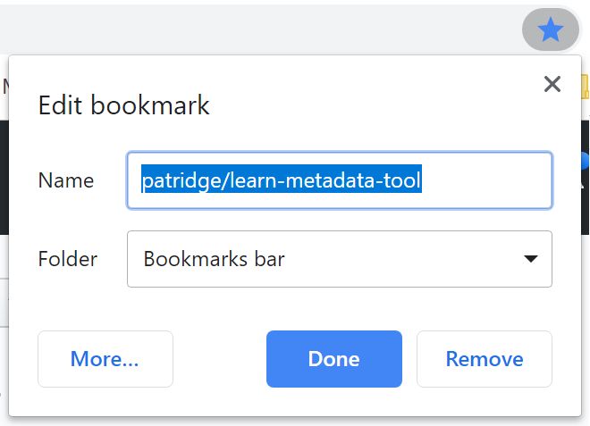
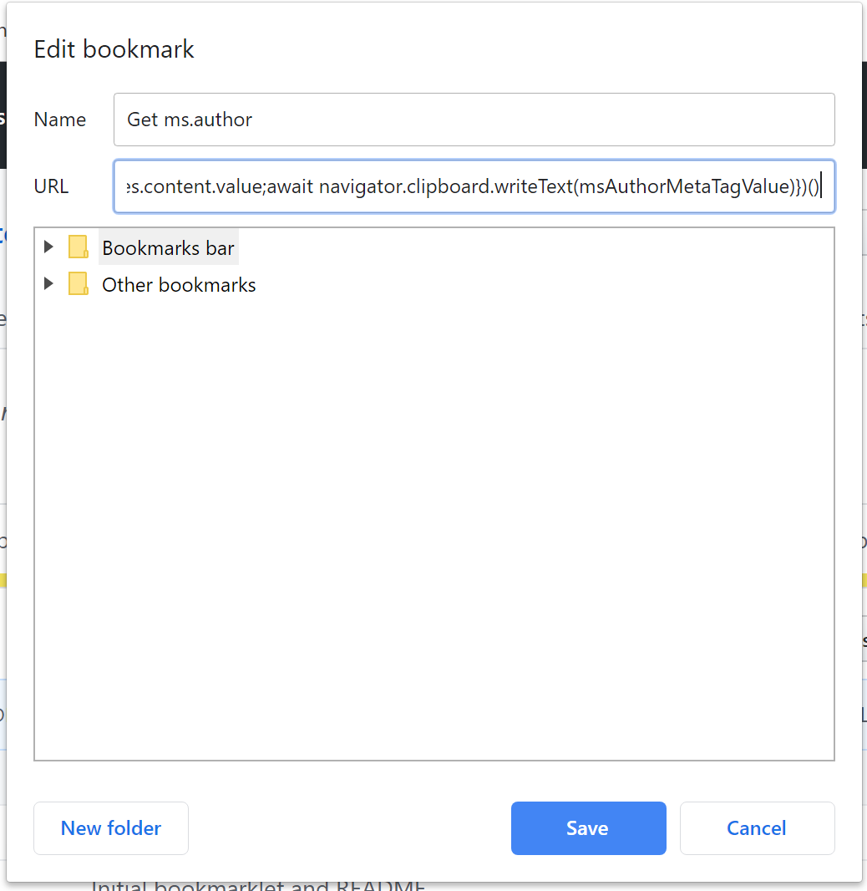

# Learn metadata query tool

Determine the author of a given Microsoft Learn page. This tool is used by the content team to help triage Minimize GitHub comment noise in your pull requests from bots using this Google Chrome extension.

## Current state

### v0.1.0: Bookmarklet

A proof-of-concept was developed that works when executed in the browser developer tools console. If you really needed this functionality in its current form, it could be encapsulated into a bookmarklet like this. (Edit the bot name prefixes in the resulting JavaScript first, though.)

1. Create a bookmark for any page, even this one.
1. Find the new bookmark and edit it. If you just bookmarked this page in Chrome, click the **More...** button to edit the bookmark address.

    

1. Inside the bookmark edit pop-up, set the address to this large block of JavaScript. (It's ugly, but that's how bookmarklets often look.)

```js
javascript:(async function(){let msAuthorMetaTagValue=document.querySelectorAll("meta[name='ms.author']")[0].attributes.content.value;await navigator.clipboard.writeText(msAuthorMetaTagValue)})()
```

1. Name your bookmark something like `Get ms.author`, so you can find it easily in your bookmarks.

    

1. Now, when you are viewing a Microsoft Learn page (and likely many other Microsoft Docs pages), just click that bookmark you created. It will find the `ms.author` metadata tag and copy the resulting author value go through the page and submit the requests to mark all prior bot comments as hidden, with the reason "Outdated".

## Roadmap

Here are the current plans for upcoming releases. These are definitely subject to change as this project develops or evolves.

### v0.2+: Chrome extension

* Host functionality in a new extension

### v0.3+: More data!

* Allow retrieving more metadata, with easy copying of fields

### v0.4+: Customization

* Allow customizing which metadata fields are important to you
